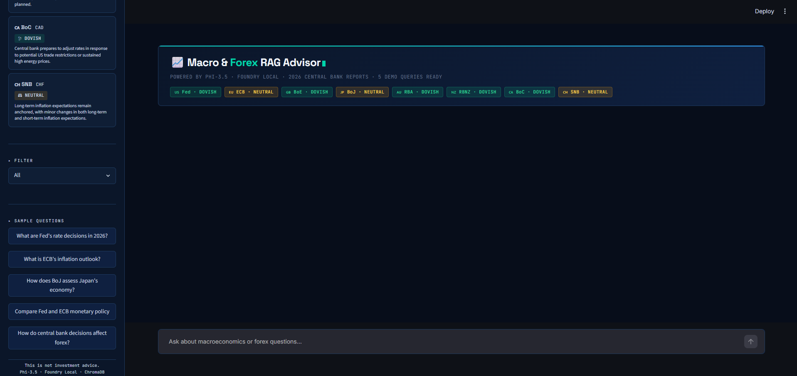
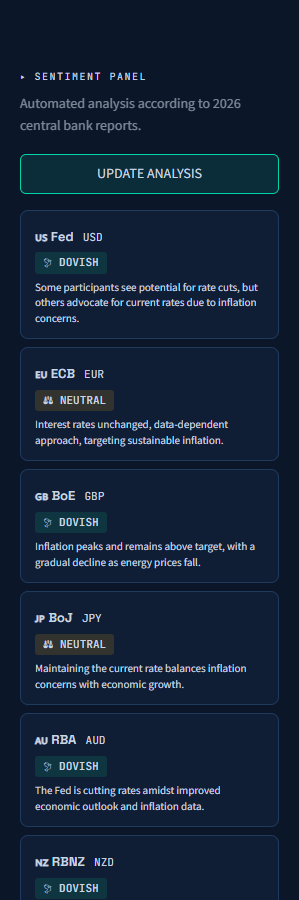
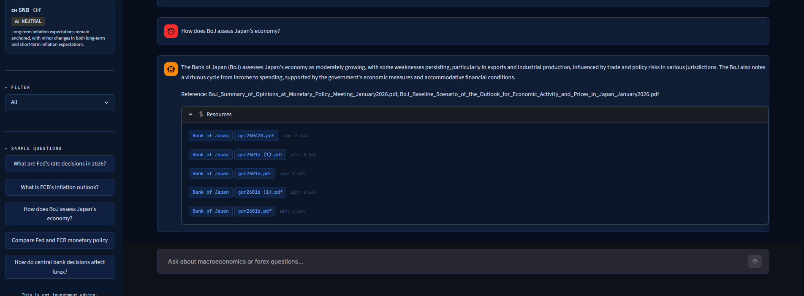

# 📈 Macroeconomic & Forex RAG Advisor

Microsoft AI Innovators Summer Internship programı kapsamında geliştirilen **Macroeconomic & Forex RAG Advisor**, 8 merkez bankasının 2026 yılı para politikası raporları üzerinde çalışan makroekonomi ve forex odaklı bir RAG asistanıdır.

Sistem; kullanıcı sorusuyla ilgili rapor parçalarını ChromaDB üzerinden getirir, Microsoft Foundry Local üzerinde çalışan yerel dil modeliyle kaynak temelli yanıt üretir ve cevabın dayandığı merkez bankası, PDF dosyası ve benzerlik skorunu kullanıcıya gösterir.

> Bu proje yatırım tavsiyesi üretmez. Merkez bankası raporlarının araştırılması, özetlenmesi ve kaynak temelli analiz edilmesi amacıyla geliştirilmiştir.

## Uygulama Görselleri

### Streamlit Arayüzü

Phi-3.5-mini, ChromaDB ve sentence-transformers bileşenlerini tek bir araştırma arayüzünde birleştiren kontrol paneli.



### Makro Sentiment Paneli

Her merkez bankasının para politikası tutumu PDF belgelerinden otomatik olarak HAWKISH, DOVISH veya NEUTRAL olarak sınıflandırılır.



### Kaynak Temelli RAG Cevabı

Kullanıcı soruları, ilgili merkez bankası rapor parçaları kullanılarak kaynak referanslarıyla yanıtlanır.



## Proje Amacı

Merkez bankası raporları uzun, teknik ve manuel olarak incelenmesi zaman alan dokümanlardır.

Bu projenin amacı, genel amaçlı bir chatbot geliştirmek yerine:

- Gerçek merkez bankası dokümanları üzerinde çalışan
- Yanıtlarını kaynak parçalarıyla destekleyen
- Yerel model ve yerel veri altyapısı kullanan
- Bulut bağlantısı veya ek maliyet gerektirmeyen
- 8 farklı merkez bankasını tek arayüzde analiz eden
- Her bankanın para politikası tutumunu otomatik sınıflandıran

bir makroekonomi RAG sistemi oluşturmaktır.

## Desteklenen Merkez Bankaları

| Kısaltma | Merkez Bankası | Para Birimi |
|---|---|---|
| Fed | Federal Reserve (FOMC) | USD |
| ECB | European Central Bank | EUR |
| BoE | Bank of England | GBP |
| BoJ | Bank of Japan | JPY |
| RBA | Reserve Bank of Australia | AUD |
| RBNZ | Reserve Bank of New Zealand | NZD |
| BoC | Bank of Canada | CAD |
| SNB | Swiss National Bank | CHF |

## Veri Kaynağı

Projede merkez bankalarının resmi web sitelerinden alınan 2026 yılı raporları kullanılmaktadır.

Mevcut veri setinde:

- 8 merkez bankası
- 10 rapor klasörü (outlook ve commodity dahil)
- **6.578 doküman parçası (chunk)**

bulunmaktadır.

## Temel Özellikler

- 2026 merkez bankası raporlarını okuma ve işleme
- Finansal doküman temizleme ve chunking (500 karakter, 150 karakter overlap)
- sentence-transformers ile yerel embedding üretimi
- ChromaDB üzerinde vektör saklama ve cosine similarity arama
- Microsoft Foundry Local ile tamamen yerel yanıt üretimi
- Kaynak temelli RAG cevapları (hangi PDF, hangi banka, benzerlik skoru)
- **Makro Sentiment Paneli**: Her banka için otomatik HAWKISH/DOVISH/NEUTRAL analizi
- **Multi-turn sohbet**: Model önceki konuşmayı hatırlar
- **Kaynak filtresi**: Belirli bir merkez bankasına odaklanma
- **Otomatik port tespiti**: Foundry Local her başlatmada portu otomatik bulur
- Modern Streamlit dark theme arayüzü (Bloomberg terminal estetiği)

## Kullanılan Teknolojiler

### AI ve Veri İşleme

- Python
- Microsoft Foundry Local
- Phi-3.5-mini
- sentence-transformers (all-MiniLM-L6-v2)
- Retrieval-Augmented Generation (RAG)
- Semantic Search / Embeddings

### Veri Katmanı

- ChromaDB (yerel vektör veritabanı)
- pypdf (PDF metin çıkarma)

### Arayüz

- Streamlit

## Sistem Mimarisi

```
2026 Merkez Bankası Raporları (PDF)
              ↓
    pypdf — Metin Çıkarma
              ↓
    Text Chunker (500 karakter)
              ↓
    sentence-transformers Embedding
              ↓
         ChromaDB
         ↙       ↘
Sentiment Analizi   Kullanıcı Sorusu
(her banka için)         ↓
         ↘          Embed + Search
          ↘              ↓
        Phi-3.5-mini (Foundry Local)
                    ↓
              Streamlit Arayüzü
```

## Örnek Sorular

```
What are Fed's rate decisions in 2026?
```

```
What is ECB's inflation outlook for 2026?
```

```
How does BoJ assess Japan's economic growth?
```

```
Compare Fed and ECB monetary policy in 2026.
```

```
How do central bank decisions affect forex markets?
```

## Kurulum ve Çalıştırma

### Gereksinimler

- Python 3.10+
- Microsoft Foundry Local kurulu
- Phi-3.5-mini modeli indirilmiş

### 1. Foundry Local kurulumu

```powershell
winget install Microsoft.FoundryLocal
foundry model run phi-3.5-mini
```

### 2. Repoyu klonla

```bash
git clone https://github.com/emreccelik/forex-rag-advisor.git
cd forex-rag-advisor
```

### 3. Python ortamını hazırla

```powershell
python -m venv venv
venv\Scripts\activate
pip install -r requirements.txt
```

### 4. Foundry Local'i başlat

```powershell
foundry service start
foundry model load phi-3.5-mini-instruct-trtrtx-gpu
```

### 5. PDF raporlarını klasörlere ekle

```
data/fomc/     → Fed (FOMC) toplantı tutanakları
data/ecb/      → Avrupa Merkez Bankası raporları
data/boe/      → Bank of England raporları
data/boj/      → Bank of Japan raporları
data/rba/      → Reserve Bank of Australia raporları
data/rbnz/     → Reserve Bank of New Zealand raporları
data/boc/      → Bank of Canada raporları
data/snb/      → Swiss National Bank raporları
data/outlook/  → Genel ekonomik görünüm raporları
data/commodity/→ Emtia raporları
```

### 6. Dokümanları indexle

```powershell
python ingest.py
```

### 7. Uygulamayı başlat

```powershell
streamlit run app.py
```

Tarayıcıda `http://localhost:8501` adresini aç.

## Proje Durumu

Projenin temel veri işleme, retrieval, model entegrasyonu, sentiment analizi ve kullanıcı arayüzü bileşenleri tamamlanmıştır.

Tamamlanan başlıca bileşenler:

- 2026 merkez bankası PDF işleme hattı
- Metin temizleme ve chunking
- sentence-transformers embedding üretimi
- ChromaDB vektör veritabanı entegrasyonu
- Cosine similarity semantic search
- Microsoft Foundry Local entegrasyonu (Phi-3.5-mini)
- Makro Sentiment Paneli (HAWKISH/DOVISH/NEUTRAL)
- Multi-turn sohbet desteği
- Kaynak şeffaflığı (PDF adı, banka, benzerlik skoru)
- Otomatik port tespiti
- Modern Bloomberg terminal temalı Streamlit arayüzü
- Kurulum ve çalıştırma dokümantasyonu

## Yasal Uyarı

Bu proje yatırım tavsiyesi vermez. Üretilen cevaplar yalnızca merkez bankası raporları üzerinden araştırma, özetleme ve doküman temelli bilgi sunma amacı taşır. Finansal kararlar için tek başına kullanılmamalıdır.

## Lisans

MIT License — detaylar için [LICENSE](LICENSE) dosyasına bakın.
